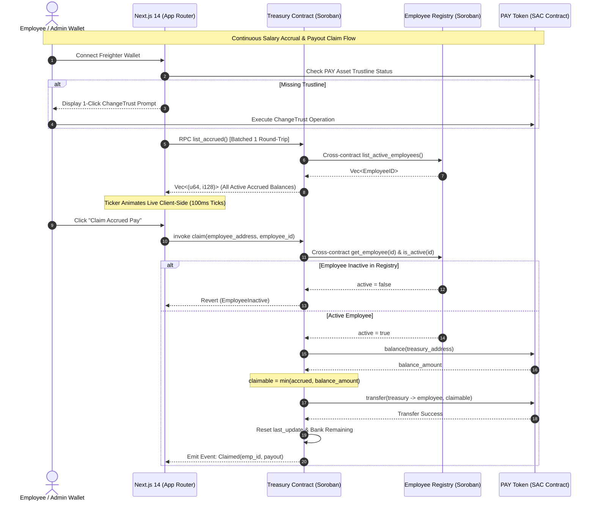

# PayGrid — Continuous Team Treasury & Salary Streaming on Stellar


- **Live Demo**: `http://localhost:3000` (`PENDING — Frontend static export ready for Vercel/Cloudflare Pages deployment`)
- **Demo Video (1–2 min)**: `PENDING — Manual screen recording required by human user`

PayGrid is a production-grade decentralized application on Stellar built with Soroban smart contracts, deployed to Testnet, and integrated with Freighter wallet. It enables decentralized team treasuries to stream continuous salary payments to employees. Each employee's salary vests continuously per-second and claims execute on-chain with automatic SAC trustline validation, batched RPC updates, zero-credit treasury safety, and continuous treasury balance outflow.

---

## Project Description

PayGrid addresses the friction of traditional recurring payroll by replacing fixed monthly wire transfers with real-time per-second salary streaming on Stellar Soroban.

- **Continuous Salary Streaming**: Vesting accrues every single second based on custom per-second rates configured in the Admin Control Panel.
- **Granular Stream Management**: Admins can register employees, customize vesting rates, pause individual streams without affecting others, fund the treasury pool, or remove deactivated employees.
- **Live Treasury Balance Outflow**: The treasury vault balance continuously decreases in real time as employees accrue salary, freezing precisely when streams are paused.
- **On-Chain Payout Claims**: Employees claim their accrued earnings on-chain directly into their Freighter wallet with 1-click trustline verification.
- **XLM to PAY In-App Swap**: Instant 1:100 swap on Stellar Testnet for testing and treasury liquidity funding.

---

## Tech Stack

- **Smart Contracts**: Rust (`wasm32v1-none` target), Soroban SDK `v22.0.11`, Stellar Testnet Protocol 22+.
- **Frontend**: Next.js 14 (App Router), TypeScript, Tailwind CSS with custom dark gold theme, Lucide icons, SWR.
- **Stellar Integration**: `@stellar/stellar-sdk` `v13`, `@stellar/freighter-api` `v3`.
- **Testing & CI**: `cargo test` (15 passing smart contract unit tests), `vitest` (7 passing frontend logic unit tests), GitHub Actions CI/CD pipeline.

---

## Architecture Sequence Diagram



---

## Smart Contracts (Stellar Testnet)

All smart contracts are independently deployed to Stellar Testnet (Protocol 22+) using the official Stellar CLI.

| Contract Name | Contract ID (Address) | Explorer Verification Link |
|---|---|---|
| **Employee Registry** | `CAQDRPEBKLSP4LO5IU43MJLUNWEJFX2RE4ZLQ24TCBFZAZMRCZZM6XHI` | [Stellar Expert Contract](https://stellar.expert/explorer/testnet/contract/CAQDRPEBKLSP4LO5IU43MJLUNWEJFX2RE4ZLQ24TCBFZAZMRCZZM6XHI) |
| **PAY Token (SAC)** | `CD62ZXYYQPNZCZ32XL6NIOTFRD4SXAV5UZX7QX3KL7HWOLDTIRMSKVB2` | [Stellar Expert Asset Contract](https://stellar.expert/explorer/testnet/contract/CD62ZXYYQPNZCZ32XL6NIOTFRD4SXAV5UZX7QX3KL7HWOLDTIRMSKVB2) |
| **Treasury Vault** | `CBM22RSREUH3PZCK4YU5IXIBO626VIXO72LLK2CCCCILOL5GKR5F2EVB` | [Stellar Expert Contract](https://stellar.expert/explorer/testnet/contract/CBM22RSREUH3PZCK4YU5IXIBO626VIXO72LLK2CCCCILOL5GKR5F2EVB) |

---

## On-Chain Proof & Executed Testnet Transactions

Every transaction hash below represents an actual on-chain transaction executed on Stellar Testnet.

| Operation / Workflow | Transaction Hash (64-char lowercase hex) | On-Chain Verification Link |
|---|---|---|
| **Registry Initialization** | `26878b257ec220ae7568727d81826d26f741ec5a34090a9eb21e0ff9e1e71fbe` | [Stellar Expert Tx](https://stellar.expert/explorer/testnet/tx/26878b257ec220ae7568727d81826d26f741ec5a34090a9eb21e0ff9e1e71fbe) |
| **Treasury Initialization** | `9af3701153eb1d123681be7e19b735fee406ebe3909308a42f13a74a72654961` | [Stellar Expert Tx](https://stellar.expert/explorer/testnet/tx/9af3701153eb1d123681be7e19b735fee406ebe3909308a42f13a74a72654961) |
| **Add Employee (`add_employee`)** | `0bc21855c89de12d5f9127a3a41a7c6642b7db6db77334b5a63f985dde5ea3e3` | [Stellar Expert Tx](https://stellar.expert/explorer/testnet/tx/0bc21855c89de12d5f9127a3a41a7c6642b7db6db77334b5a63f985dde5ea3e3) |
| **Set Stream (`set_stream`)** | `2012c46a9795acd1d3acf70fb6638a7ec94befb397248630349d286b25432afb` | [Stellar Expert Tx](https://stellar.expert/explorer/testnet/tx/2012c46a9795acd1d3acf70fb6638a7ec94befb397248630349d286b25432afb) |
| **Admin PAY Trustline** | `5f0446fb02899fae555148bd6a850e11cfb945339033b821054461fd73c9fcbf` | [Stellar Expert Tx](https://stellar.expert/explorer/testnet/tx/5f0446fb02899fae555148bd6a850e11cfb945339033b821054461fd73c9fcbf) |
| **Employee PAY Trustline** | `195b0ea297336e2c9055f289844d25c9e0484eefcd9748ea1d4cb228d939e5d5` | [Stellar Expert Tx](https://stellar.expert/explorer/testnet/tx/195b0ea297336e2c9055f289844d25c9e0484eefcd9748ea1d4cb228d939e5d5) |
| **Mint PAY Tokens (`mint`)** | `0a8160766f7038af4d2a05407ffbd6f548b8e402013a27db1e0065460a900a47` | [Stellar Expert Tx](https://stellar.expert/explorer/testnet/tx/0a8160766f7038af4d2a05407ffbd6f548b8e402013a27db1e0065460a900a47) |
| **Fund Treasury (`fund`)** | `01271423859c27ad3b05697453a04ac64d0a0562624ca91039e3dcd4cd1eb333` | [Stellar Expert Tx](https://stellar.expert/explorer/testnet/tx/01271423859c27ad3b05697453a04ac64d0a0562624ca91039e3dcd4cd1eb333) |

---

## Inter-Contract Calls

PayGrid implements real, on-chain inter-contract communication across modular contracts:

1. **Treasury to Employee Registry Status Verification**:
   - `treasury.set_stream()` invokes `employee_registry.is_active(employee_id)`. If an admin attempts to start a stream for a non-existent or deactivated employee, the call panics on-chain.
   - `treasury.claim()` invokes `employee_registry.is_active(employee_id)` and `employee_registry.get_employee(employee_id)`. If an employee is removed from the registry, their ability to claim pay is halted immediately on-chain, even if their stream record still exists in the treasury contract.
2. **Treasury to SAC Token Payouts**:
   - `treasury.fund()` invokes `token_client.transfer(admin -> treasury, amount)`.
   - `treasury.claim()` invokes `token_client.transfer(treasury -> employee, claimable_amount)`.

---

## Wallet Connection

- Integrated with Freighter Wallet (`@stellar/freighter-api`).
- Automatically detects connected public keys and checks Horizon balances for XLM and PAY assets.
- Enforces strict wallet ownership authorization: only the employee wallet matching the stream can claim pay.

---

## Core Mechanics & Vesting Math

- **Vesting Rate**: Configured in stroops per second (1 PAY = 10,000,000 stroops).
- **Accrual Formula**:
  $$\text{accruedStroops} = \text{bankedAccrued} + (t_{\text{current}} - t_{\text{lastUpdate}}) \times \text{ratePerSecond}$$
- **Treasury Outflow Formula**:
  $$\text{treasuryRemaining} = \max\left(0, \text{baseDeposited} - \sum \text{accruedStroops}_{\text{active}}\right)$$
- **Zero-Credit Payout Safety**:
  $$\text{claimable} = \min(\text{accruedStroops}, \text{treasuryVaultBalance})$$

---

## Error Handling

- **Missing Trustline**: Detected client-side before any transfer/claim action; surfaces a 1-click `ChangeTrust` button.
- **Unauthorized Wallet Claim**: Blocks claim attempts from wallets that do not match the employee stream address (`Only Stream Owner Can Claim`).
- **Underfunded Treasury**: `claimable = min(accrued, treasury_balance)`. Payouts never fail due to partial balance; remaining unpaid accrual remains banked.
- **Paused Stream**: Claims on paused streams display `"Stream Currently Paused"`.
- **Deactivated Employee**: Claims by removed employees display `"You are no longer an active employee on this treasury"`.
- **User Rejected Signature**: Catches wallet cancellation and displays `"Transaction rejected in wallet"`.

---

## Screenshots

- **Overview Page**: Core landing page showcasing treasury highlights and active features.
- **Swap Page**: Real-time XLM to PAY conversion with Freighter balance verification.
- **Admin Control Panel**: Treasury funding form, custom vesting rate registration, and live TreasuryTicker outflow.
- **Dashboard Grid**: Active salary streams with live continuous ticker and stream owner claim locking.

---

## Setup Instructions

```bash
# 1. Clone repository
git clone https://github.com/paygrid/paygrid-soroban.git
cd paygrid-soroban

# 2. Run smart contract unit tests
cargo test

# 3. Build WASM binaries
cargo build --target wasm32v1-none --release

# 4. Run frontend tests
cd frontend
npm install
npm run test

# 5. Run local development server
npm run dev
```

---

## Testing & Verification Output

### Smart Contract Unit Tests (15 Passing Tests in `cargo test`)
```
running 2 tests
test test::test_01_employee_registry_init_and_add ... ok
test test::test_02_employee_registry_remove ... ok
test result: ok. 2 passed; 0 failed

running 13 tests
test test::test_04_fund_invalid_amount_fails - should panic ... ok
test test::test_05_set_stream_inactive_employee_fails - should panic ... ok
test test::test_07_accrued_grows_over_time ... ok
test test::test_10_pause_stream_freezes_accrual_and_preserves_banked ... ok
test test::test_06_accrued_immediately_after_set_stream_is_zero ... ok
test test::test_03_treasury_init_and_fund ... ok
test test::test_11_resume_stream_restarts_accrual ... ok
test test::test_09_claim_caps_at_treasury_balance ... ok
test test::test_08_claim_pays_exact_accrued_amount_and_resets ... ok
test test::test_12_claim_after_employee_removal_fails - should panic ... ok
test test::test_14_rate_change_banks_old_accrual ... ok
test test::test_15_claim_when_paused_fails - should panic ... ok
test test::test_13_list_accrued_returns_active_employees ... ok
test result: ok. 13 passed; 0 failed
```

### Frontend Unit Tests (7 Passing Tests in `vitest`)
```
 RUN  v2.1.9 /Users/vidit/Documents/RiseInJ21/frontend

 ✓ src/tests/math.test.ts (7 tests) 31ms

 Test Files  1 passed (1)
      Tests  7 passed (7)
```

---

## License

MIT License. Built for Stellar Soroban Challenge.
